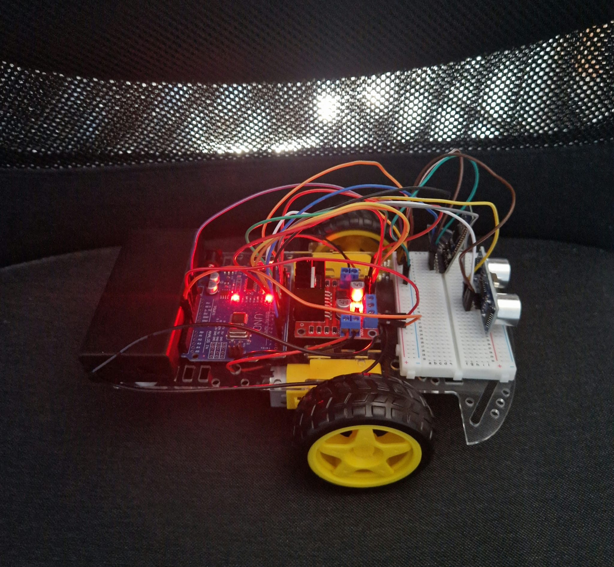

# 🏎️  Dual-Mode Arduino Car

<p align="center">
  
</p>

> A robotics project based on **Arduino UNO**, developed for the Microprocessors lab. The smart car features a hybrid operating mode (Manual Control via Bluetooth / Autonomous Mode with obstacle avoidance) and is programmed at the hardware level, using direct register manipulation and timers instead of standard Arduino functions.

##  Team

* **Chițimia Diana-Andreea** – Hardware / Software
* **Pogonici-Bălțățeanu Tiberiu** – Hardware / Software

> *Project developed for the **Microprocessors** course, Year 2, **Politehnica University of Timișoara**.*
---

## 📝 Project Description
This project represents the physical and software implementation of an autonomous 2WD vehicle.

The car can be controlled from a smartphone app, but at the press of a button, it switches to "Auto-Pilot", navigating its environment using an ultrasonic sensor.

### ✨ Operating Modes:
1. **🎮 Manual Mode (Bluetooth):** Directional control (Forward/Backward/Left/Right) via the **Dabble** smartphone app.
2. **🤖 Autonomous Mode:** The car drives itself forward. When the HC-SR04 sensor detects an obstacle at a distance of less than 20 cm, the car brakes, reverses, and turns right to avoid the blockage before resuming its path. (the sensor is currently at the back of the car)

---

## 🛠️ Hardware Components

The following components were used to build this project:
*  1x Arduino UNO compatible development board (ATmega328P)
*  1x 2WD Smart Car Kit (acrylic chassis, 2 wheels, 1 caster wheel)
*  2x DC Motors
*  1x L298N Motor Driver (H-Bridge)
*  1x HC-SR04 Ultrasonic Sensor
*  1x BLE Bluetooth Module (HM-10) iOS & Android compatible
*  2x 18650 Li-ion Batteries (7.4V total) + Battery Holder + Power Switch
* Mini-Breadboard and Dupont jumper wires (M-M, M-F)

---

## 💻 Technical & Software Concepts

Unlike standard Arduino projects, the source code implements specific Embedded Systems techniques:

* **Direct Port Manipulation (Port Registers):** No `digitalWrite()` or `pinMode()` functions are used. Pin configuration and motor direction control are achieved by directly modifying the bits in the `DDRB`, `DDRD`, `PORTB`, and `PORTD` registers.
* **Hardware Timers (Fast PWM):** Motor speed is not generated using `analogWrite()`. Instead, **Timer1** is set up in Fast PWM mode by directly configuring the `TCCR1A` and `TCCR1B` registers, and the duty cycle (speed) is defined through the `OCR1A` and `OCR1B` registers.
* **Communication:** The `Dabble` library is used to parse Bluetooth signals from the smartphone.

---

## ⚙️ Wiring Schema (Pinout)

| Component | Arduino Pin | Associated Register |
| :--- | :--- | :--- |
| **L298N - ENA** | Pin 9 | Timer1 (OC1A) |
| **L298N - ENB** | Pin 10 | Timer1 (OC1B) |
| **L298N - IN1** | Pin 4 | PORTD (Bit 4) |
| **L298N - IN2** | Pin 5 | PORTD (Bit 5) |
| **L298N - IN3** | Pin 6 | PORTD (Bit 6) |
| **L298N - IN4** | Pin 7 | PORTD (Bit 7) |
| **HC-SR04 - Trig** | Pin 8 | PORTB (Bit 0) |
| **HC-SR04 - Echo** | Pin 12 | PORTB (Bit 4) |
| **BT HM-10 - TX** | Pin 2 | SoftwareSerial (RX) |
| **BT HM-10 - RX** | Pin 3 | SoftwareSerial (TX) |


---

## 👨‍💻 Source Code

```cpp
#define CUSTOM_SETTINGS
#define INCLUDE_GAMEPAD_MODULE
#include <Dabble.h>
#include <SoftwareSerial.h>

// Set Bluetooth pins
SoftwareSerial Bluetooth(2, 3); // RX, TX

bool autonomousMode = false; // The car starts in manual mode
unsigned int distance = 0;

void setup() {
  Serial.begin(9600); // For PC debugging
  Dabble.begin(9600, 2, 3); // Initialize Dabble on pins 2 and 3

  // --- PIN CONFIGURATION VIA REGISTERS (Without pinMode) ---
  // Port D controls pins 0-7. Set pins 4,5,6,7 as OUTPUT (for IN1, IN2, IN3, IN4)
  DDRD |= 0b11110000; // 1 means OUTPUT
  
  // Port B controls pins 8-13. 
  // Set pins 9 (ENA), 10 (ENB), and 8 (Trig) as OUTPUT.
  DDRB |= 0b00000111; 
  // Set pin 12 (Echo) as INPUT
  DDRB &= ~(1 << PB4);

  // --- TIMER1 CONFIGURATION FOR HARDWARE PWM (Without analogWrite) ---
  // Use Timer1 in Fast PWM, 8-bit mode. It will automatically generate signals on pins 9 and 10.
  TCCR1A = (1 << COM1A1) | (1 << COM1B1) | (1 << WGM10);
  TCCR1B = (1 << WGM12)  | (1 << CS11)   | (1 << CS10); // Prescaler of 64
  
  // Set initial speed (0 = stopped, 255 = max) using Timer registers directly
  OCR1A = 150; // Left motor speed
  OCR1B = 150; // Right motor speed
  
  stopMoving(); // Ensure it stays still at startup
}

void loop() {
  Dabble.processInput(); // Listen for phone commands

  // Check if TRIANGLE button is pressed to switch modes
  if (GamePad.isTrianglePressed()) {
    autonomousMode = !autonomousMode; // Toggle state (from manual to auto or vice versa)
    stopMoving();
    delay(300); // Short debounce so it doesn't read multiple presses
  }

  if (autonomousMode) {
    // --- AUTONOMOUS MODE ---
    distance = readSensor(); // Read distance using port manipulation
    
    if (distance > 0 && distance < 20) {
      // If it sees an obstacle under 20 cm
      stopMoving();
      delay(300);
      
      moveBackward();
      delay(500); // Back up for half a second
      
      moveRight(); // Rotate right to avoid
      delay(400); 
    } else {
      moveForward(); // Clear path, go ahead!
    }
    
  } else {
    // --- MANUAL MODE (Dabble Arrow Control) ---
    if (GamePad.isUpPressed()) {
      moveForward();
    } else if (GamePad.isDownPressed()) {
      moveBackward();
    } else if (GamePad.isLeftPressed()) {
      moveLeft();
    } else if (GamePad.isRightPressed()) {
      moveRight();
    } else {
      stopMoving(); // If nothing is pressed, stay still
    }
  }
}

// --- MOVEMENT FUNCTIONS USING REGISTERS (Without digitalWrite) ---
// Modify the state of pins 4, 5, 6, 7 simultaneously using PORTD

void moveForward() {
  // IN1=1, IN2=0 (Left forward), IN3=1, IN4=0 (Right forward)
  PORTD = (PORTD & 0b00001111) | 0b01010000;
}

void moveBackward() {
  // IN1=0, IN2=1, IN3=0, IN4=1
  PORTD = (PORTD & 0b00001111) | 0b10100000;
}

void moveLeft() {
  // Left motor backward, right motor forward
  PORTD = (PORTD & 0b00001111) | 0b01100000;
}

void moveRight() {
  // Left motor forward, right motor backward
  PORTD = (PORTD & 0b00001111) | 0b10010000;
}

void stopMoving() {
  // All pins to 0
  PORTD = (PORTD & 0b00001111);
}

// --- SENSOR READING WITHOUT STANDARD ARDUINO FUNCTIONS ---
long readSensor() {
  // 1. Send a 10-microsecond pulse on Trig pin (Pin 8 -> PB0)
  PORTB &= ~(1 << PB0); // Trig LOW
  delayMicroseconds(2);
  PORTB |= (1 << PB0);  // Trig HIGH
  delayMicroseconds(10);
  PORTB &= ~(1 << PB0); // Trig LOW

  // 2. Wait for Echo pin (Pin 12 -> PB4) to become HIGH
  long timeout = micros();
  while (!(PINB & (1 << PB4))) {
    if (micros() - timeout > 30000) return 0; // Timeout if nothing is found
  }

  // 3. Measure how long Echo stays HIGH
  long startTime = micros();
  while (PINB & (1 << PB4)) {
    if (micros() - startTime > 30000) return 0; // Timeout
  }
  long duration = micros() - startTime;

  // Distance calculation: speed of sound is ~0.034 cm/microsecond (divided by 2, round trip)
  return duration * 0.034 / 2;
}


---

<!--  -->
